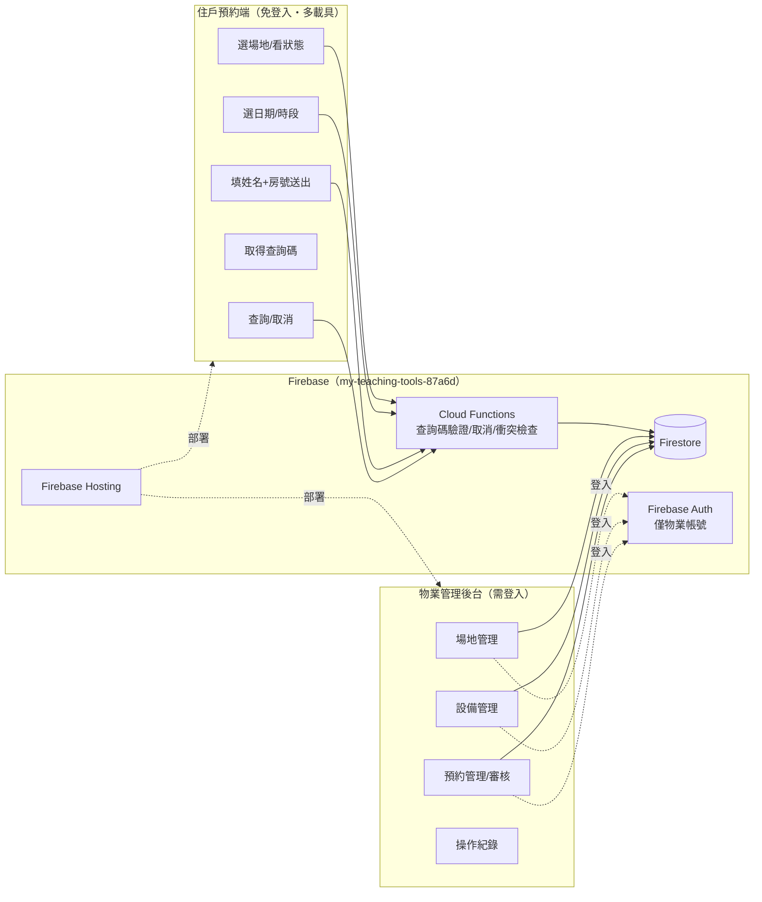

# 社區設施預約系統 — 系統規劃藍圖

> 依據 RDQ 需求規格卡（`C:\Users\jnfa\NotebookLM\rdq\RDQ-spec-community-facility-booking-20260806.md`，status: confirmed）產出。
> 版本：v1（2026-08-06）

## 1. 系統架構總覽

兩個前端 + 一個共用後端：



**技術棧建議**（沿用工作區既有的輕量風格，非大型框架）：
- 前端：Vanilla JS + Firebase Web SDK，兩個獨立頁面（住戶端 `index.html`、物業後台 `admin.html`），響應式 CSS（Grid/Flexbox）支援電腦/手機/平板
- 後端：Firestore（資料）＋ Cloud Functions（查詢碼驗證、取消、送出時的衝突檢查——**不要**把這幾件事完全交給前端直接寫 Firestore，避免競態與查詢碼被枚舉猜中）
- 部署：Firebase Hosting，`firebase deploy`
- 版本控制：已就緒 [shingyong02-sudo/Reservation](https://github.com/shingyong02-sudo/Reservation)

## 2. 資料模型（Firestore）

```
facilities/{facilityId}
  name: "棋藝室" | "KTV室" | "健身室" | "親子育樂室" | "宴會廳" | "SPA室"
  capacity: number            # 物業可調，不寫死
  status: "open" | "closed"
  bookingMode: "auto" | "review"   # 預設 auto，個別場地可切 review
  slotType: "fixed" | "halfday_fullday"   # 宴會廳建議用後者
  dailyLimitPerUnit: number   # 同房號單日可訂次數上限
  weeklyLimitPerUnit: number
  updatedAt / updatedBy

facilities/{facilityId}/timeSlotTemplates/{slotId}
  startTime: "09:00"
  endTime: "10:00"
  weekdays: [1,2,3,4,5,6,7]   # 哪些星期開放

facilities/{facilityId}/equipment/{equipmentId}
  name: "跑步機 #2"
  status: "normal" | "maintenance" | "retired"
  note: "馬達異音，預計 8/10 修復"
  updatedAt / updatedBy

bookings/{bookingId}
  facilityId
  date: "2026-08-10"
  slotId / startTime / endTime
  applicantName / unitNumber(房號) / peopleCount / phone(選填)
  queryCode: 隨機 8 碼            # 事後查詢/取消用
  status: "confirmed" | "pending_review" | "cancelled" | "rejected"
  createdAt / cancelledAt

bookingLogs/{logId}
  targetType: "booking" | "facility" | "equipment"
  targetId
  action: "create" | "cancel" | "approve" | "reject" | "equipment_status_change" | "config_change"
  actor: "resident" | "property:<帳號>"
  detail: {...}
  timestamp
```

**關鍵設計原則**：`facilities`／`equipment`／`timeSlotTemplates` 全部是資料，物業後台 CRUD 即可調整，**不需要改一行程式碼**——直接對應原始需求「設備會故障要能調整、不能寫死」「物業隨時可調整」。

## 3. 核心流程

**住戶預約**：選場地 → 讀該場地當日時段（自動排除已被訂走、或因設備 `maintenance` 而不可用的時段）→ 填資料送出 → Cloud Function 用 transaction 檢查「同時段是否已被搶走」＋「同房號是否超過次數上限」→ 依 `facility.bookingMode` 寫入 `confirmed` 或 `pending_review` → 回傳查詢碼。

**住戶查詢/取消**：輸入查詢碼＋房號（雙因子，防止單靠猜碼查到別人資料）→ Cloud Function 驗證後回傳明細 → 可取消（寫 `bookingLogs`）。

**設備故障**：物業在後台把設備標成 `maintenance` 並填備註 → 若此設備被標記為該場地「必要設備」，系統自動把受影響時段從可預約清單移除，**已被訂走的時段不自動取消**，改為在物業後台跳出提醒，由物業人工聯繫住戶決定。

**審核**（`bookingMode = review` 的場地）：預約先進 `pending_review`，物業在後台核准/拒絕，核准才轉 `confirmed`。

## 4. 頁面規劃

**住戶端**（`index.html`，免登入）
1. 首頁：六張場地卡片（顯示目前狀態、是否有設備維修中提示）
2. 預約頁：選日期 → 時段格（已滿/維修中的格子標灰不可選）→ 填姓名/房號/人數/電話(選填) → 送出
3. 完成頁：大字顯示查詢碼＋一鍵複製，提醒「請截圖保存」
4. 查詢頁：查詢碼＋房號 → 顯示明細／取消按鈕

**物業後台**（`admin.html`，Firebase Auth 登入）
1. 登入頁
2. 儀表板：今日/本週預約總覽、設備維修中警示列表
3. 場地管理：容納人數、時段規則、審核開關（auto/review）、啟用/停用
4. 設備管理：依場地分組，狀態切換（正常/維修中/汰除）＋備註
5. 預約管理：依場地/日期/狀態篩選，待審核區塊，核准/拒絕/取消
6. 操作紀錄：時間軸，可篩選對象與動作類型

## 5. ❓ 待補確認（規劃階段新浮現，非重跑訪談，先列出讓你掃一眼）
- **物業後台登入方式未定**：原始 RDQ 只談了住戶端「免登入」，後台目前規劃預設用 Firebase Auth（Email/密碼），僅限授權帳號——這欄需要你確認或指定要用哪幾個帳號
- **設備「必要／非必要」的判斷**：故障是否自動擋時段，取決於這台設備是否被標為該時段「必要」（例如 KTV 室麥克風壞了要不要直接不能訂）——目前預設物業在設備資料上自行勾選「是否影響可預約」，細節等後台介面設計時再確認
- **查詢碼格式與有效期**：預設 8 碼英數混合、永久有效（配合房號雙因子查詢）；若想要更嚴格（例如加簡訊驗證）之後可加

## 6. 開發順序建議
1. Firebase 專案設定：Firestore 資料結構＋安全規則（先擋掉未授權的 facilities/equipment 寫入）
2. 物業後台：場地/設備 CRUD（最基礎，其他功能都依賴這層資料）
3. 住戶端：預約流程（讀資料→選時段→送出→查詢碼）
4. Cloud Functions：衝突檢查、查詢碼驗證/取消
5. 物業後台：預約管理／審核／操作紀錄
6. 響應式與多裝置測試、上線
